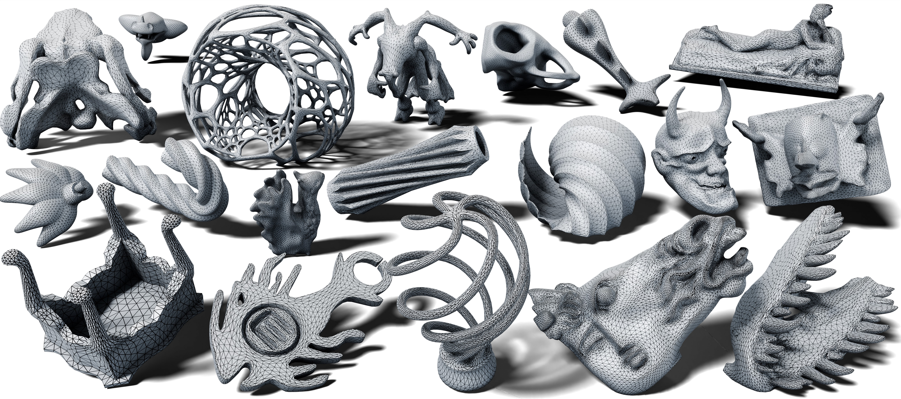

# NASM - Neural Anisotropic Surface Meshing

Official Implementation for *NASM: Neural Anisotropic Surface Meshing*

*SIGGRAPH Asia (Conference Track) 2024*

```
@misc{li2024nasmneuralanisotropicsurface,
      title={NASM: Neural Anisotropic Surface Meshing}, 
      author={Hongbo Li and Haikuan Zhu and Sikai Zhong and Ningna Wang and Cheng Lin and Xiaohu Guo and Shiqing Xin and Wenping Wang and Jing Hua and Zichun Zhong},
      year={2024},
      eprint={2410.23109},
      archivePrefix={arXiv},
      primaryClass={cs.CV},
      url={https://arxiv.org/abs/2410.23109}, 
}
```
## Dataset
TBD

## NM-CVT
We use the NM-CVT algorithm to generate final mesh from the high dimensional embeddings. For technical details, please refer to Section 4 in the paper.  
The code is available at [NM-CVT](https://github.com/Hongbo-huayra/NM-CVT).